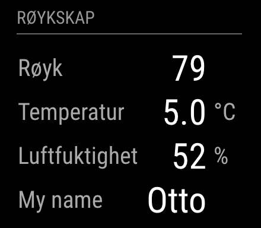

# MQTT

Module for [MagicMirror](https://github.com/MichMich/MagicMirror/) showing the payload of a message from MQTT.

## Installasjon

Go to `MagicMirror/modules` and write

    git clone git@github.com:ottopaulsen/MMM-MQTT.git
    cd MMM-MQTT
    npm install

## Configuration

This is the default configuration with description. Put it in the `MagicMirror/config/config.js`:

    {
        module: 'MMM-MQTT',
        position: 'bottom_left',
        header: 'MQTT',
        config: {
            mqttUser: 'user',         // Leave out for no user
            mqttPassword: 'password', // Leave out for no password
            mqttServer: 'localhost',
            subscriptions: [
                {
                    topic: 'sensor/1/temperature',
                    label: 'Temperature',
                    decimals: 1,
                    suffix: '°C'
                },
                {
                    topic: 'sensor/1/humidity',
                    label: 'Humidity',
                    decimals: 0
                },
                {
                    topic: 'guests',
                    label: 'First guest',
                    jsonpointer: '/people/0/name'
                }
            ]
        }
    }

### JSON Data

If the payload contains JSON data, use the jsonpointer configuration to get the value. See [JSON Ponter specification](https://tools.ietf.org/html/rfc6901) or google an easier description.

## TO DO

Create a timeout, so values are deleted if they are not refreshed. May be faded out...

Create a treshold so a value is flashing if outside treshold.